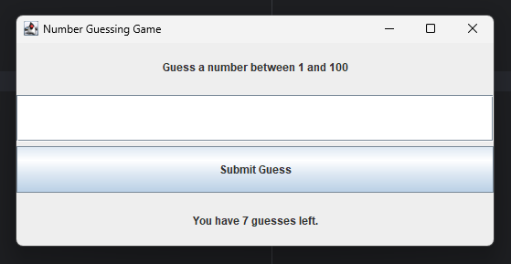
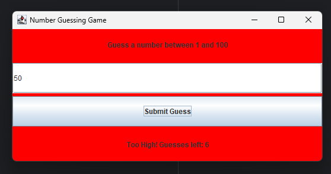
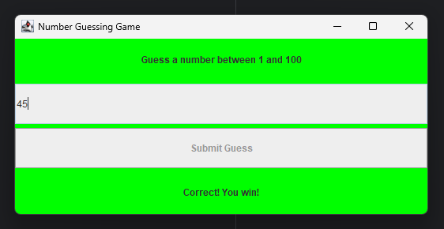

# Number Guessing Game

This is a simple number guessing game built using Java and Swing. The user has 7 attempts to guess a randomly generated number between 1 and 100. The interface provides visual feedback and hints after each guess.

---

## Features

- Random number generation between 1 and 100
- Limited to 7 guesses
- Visual feedback (color changes on correct/incorrect guesses)
- Hint messages: "Too High" or "Too Low"
- Automatically ends on win or after 7 incorrect attempts

---

## Screenshots

*Below are a few screenshots from the game:*

**Initial Interface**



**Incorrect Guess - Hint Message**



**Correct Guess - Success Message**



---

## Technologies Used

- Java (JDK 8 or above)
- Java Swing (for GUI)
- IntelliJ IDEA (recommended IDE)

---

## How to Run

1. Clone the repository:
   ```bash
   git clone https://github.com/midu-01/OIBSIP.git
2. Navigate to the `NumberGuessingGame` directory in your IDE (e.g., IntelliJ IDEA).

3. Open and run `Main.java`.

---

# ATM Interface

This is a simple **ATM Interface application** developed using **Java** and **Swing**. It simulates basic banking operations such as balance inquiry, deposit, withdrawal, money transfer, and transaction history. The system supports both **GUI-based interaction** using Swing and **console-based execution**, demonstrating an understanding of core Java, OOP principles, and user interface design.

---

## Features

- User authentication with ID and PIN
- View current balance
- Deposit and withdraw money
- Transfer money to other recipients
- Transaction history tracking
- GUI (Swing) and Console-based versions available

---

## Screenshots

*Below are a few screenshots from the Interface:*

**Login Interface**


**User Interface**


**Initial Balance**


**Deposit**


**Updated Balance**


**withdrow**


**Updated Balance**


**Transfer**


**Transaction History**


---

## Technologies Used

- Java (JDK 8 or above)
- Java Swing (for GUI)
- IntelliJ IDEA (recommended IDE)
- Console I/O (for CLI operations)

---

## How to Run

### GUI Version
1. Clone the repository:
   ```bash
   git clone https://github.com/midu-01/OIBSIP.git
2. Open the project in **IntelliJ IDEA** or any other Java IDE.
3. Run the `Main.java` file.
4. Use the following login credentials when prompted:

   - **User ID:** `user`  
   - **PIN:** `123`

## Internship Information
This project was developed as part of the Oasis Infobyte Internship Program (OIBSIP).
It demonstrates key Java programming concepts such as:

- Object-Oriented Design

- GUI development with Swing

- Data modeling and encapsulation

- Input validation and error handling

---

## Author

- GitHub: [Midu Mojumder](https://github.com/midu-01)
- Email: midumojumder8@gmail.com
